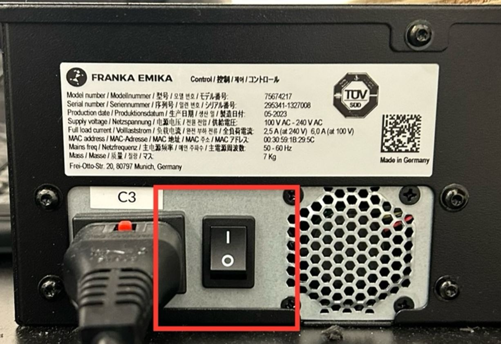
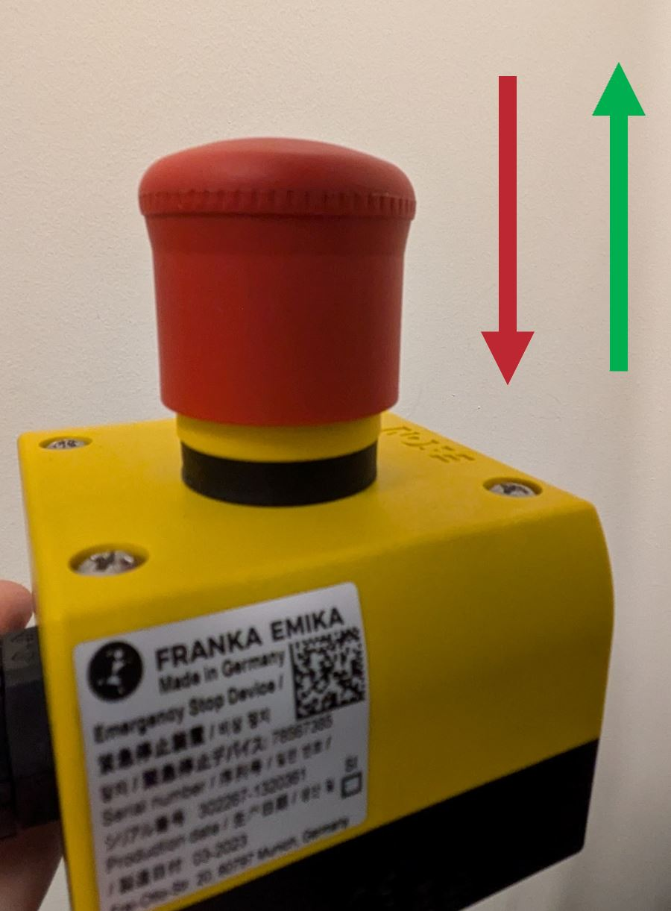

# FR3 Basics

## Arm and Gripper

- 7-DoF robotic arm
- Integrated torque sensors
- Gripper type: Franka Hand
- Payload limit ~3 kg

## Ethernet Cable

- A direct Ethernet connection is required between the control box and the computer controlling the arm.

## Control Box

- Located underneath the FR3 arm platform.
- Used to power the robot on/off.

## FR3 Basics: E-stop

- Safety button that immediately stops arm motion and locks all joints.
- Press the button to stop the robot.
- Pull (release) the red button to reset the system.
  - **Note:** You just need to pull the red portion up; there is no twist or any other movement necessary.

