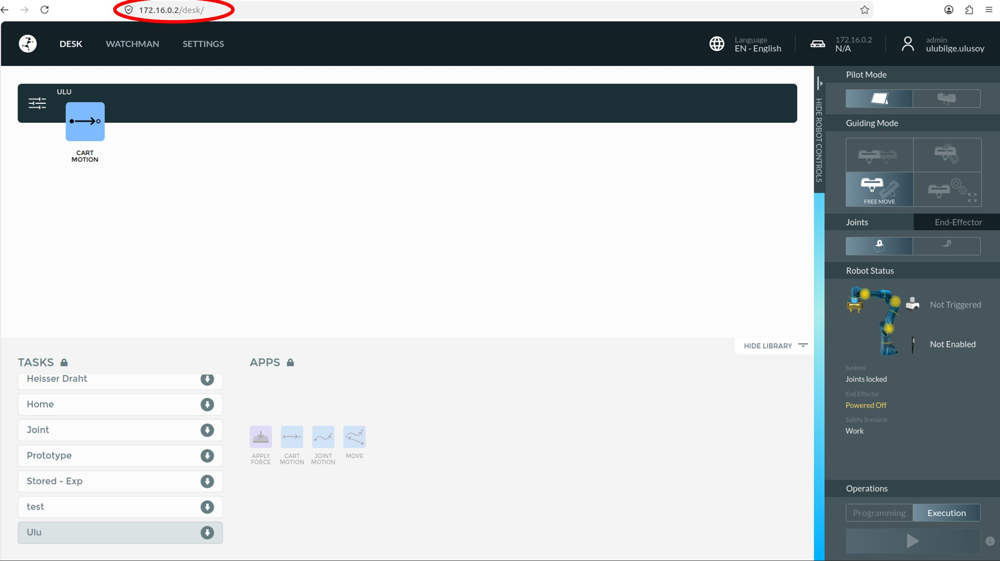
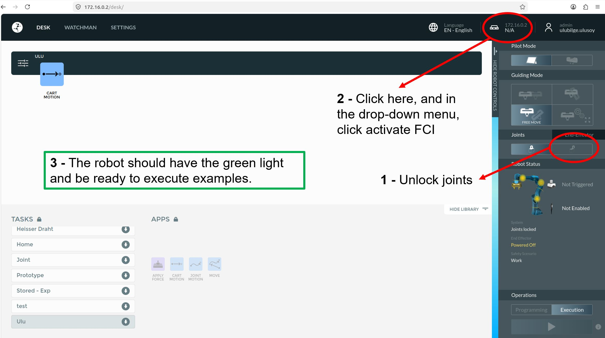

# FR3 Start-up Checklist

- Connect ethernet cable from robot arm control box to the computer you control the robot arm.

- Under the robot, find the on/off switch on the control box and power on the FR3 robot.
- Power on and log in to the computer that you are planning to control the FR3.
- Open Firefox (or any other browser), enter the FR3 IP address (`172.16.0.2`) and press enter to open the FCI web interface.

These two tutorials give you the basics of this web interface. Please check them to make sure that you are familiar with them.

- [Tutorial 1](https://www.youtube.com/watch?v=TRMIA2J29MA&list=PL9FoYHNFGS3TyHsLcL0-qNIi-e14Xw7np&index=1)
- [Tutorial 2](https://www.youtube.com/watch?v=hCfn0mzHLyM&list=PL9FoYHNFGS3TyHsLcL0-qNIi-e14Xw7np&index=2)

For executing the example capabilities in this document, you will need to perform the steps indicated in picture below to make the FR3 ready.

